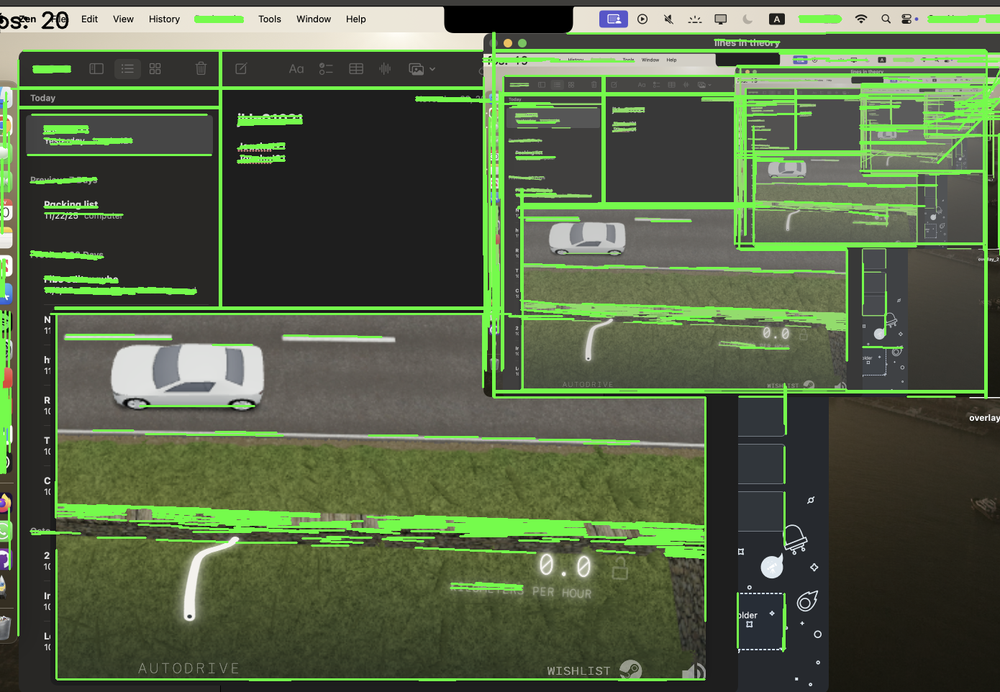

# Project Overview

One of my biggest hobbies is racing, especially f1, along with racing and driving games. My orginal idea for this project was to create a basic "self driving car" in a game called Assetto Corsa on a server called NoHesi (which is a server that mods the cars and driving to drive on a highway with traffic bots, where the goal is to drive as fast as possible without crashing), but for this project, and so that I could work on this project at school, I have chosen an online io game called slowroads.io 

The premise of the game is simple, its a "zen driving game" where there is no racing, but nonetheless is a fun relaxing endless driving game, with most importantly, road lines and a centerline. 

The idea is that I will be able to crop the image displayed on screen, and then from there, detect road lines and keep it driving, hopefully without crashing.

# Goals before starting
1. improve readability in code by using more functions, and better organization along with comments
2. create something I feel somewhat connected to, something that I can feel proud of but also something that pushes me while being something that I am interested in.
3. have fun and learn

# Step 1: Planning
 - warp the image to only see whats infront, and crop the image to make it so that you can only see the roadlines and whats under to reduce the amount of junk on screen and speed up detection
 - display lines for viewer through transparent window overlay 
 - find a way to control the car based on where lines are -- how to detect turns?

# Step 2: Screen capture
The goal for this first coding session is to start by just being able to capture the screen in a way that OpenCV can view it. Some of my options included mss, PIL, and forcing a screenshot using a hotkey, along with ffmpeg. While ffmpeg may be optimal, I will chose to us mss due to simplicity and performance.

### Result
For this, I chose to use mss, and to do fps testing, I used this helpful tutorial from [GeeksForGeeks](https://www.geeksforgeeks.org/python/python-displaying-real-time-fps-at-which-webcam-video-file-is-processed-using-opencv/). I found it to be pretty efficient at around 20 fps on average.
>
We can see the fps counter if you look closely at the top left, although it is very much covered by the fact that it is showing screen in screen, which is likely a significant contributor to the lower FPS in this image.

The code snippet is pretty simple, it uses mss, a cross platform python package to get a screenshot of the screen, and in practice is just an efficent method of grabbing the livestream frame by frame, in a way that opencv can handle. 

~~~python
...

with mss.mss() as sct:
        monitor = sct.monitors[1]
        while True:
            sct_img = sct.grab(monitor)
            frame = sct_img
            frame = np.array(frame)
            ...
~~~

# Step 3: Overlay 
One of the largest issues for this project is the fact that there is clearly a large opencv window displaying the debugging in the top left of our screen, so to solve this, it would be helpful to create a transparent window overlay above the desktop, that is clickthrough and see through. 

Im really struggling with the overlay, the majority of my overlay code is in overlay_test.py, and is an adapted version of some code i found on [Stack Overflow](https://stackoverflow.com/questions/43666230/tkinter-create-canvas-that-overlays-screen-with-transparent-background), which was then adapted by Claude for MacOS use after I discovered that different platforms require different things. From there I attempted to understand what was going on, which can be seen in my comments.

I then tried to implement the overlay, in a seperate file that won't be on the repository, but realized that it would be super complicated and very hard to actaully read all the lines (and this is likely something that I could have solved if I had more time, and something that I may come back to one day). 

>Just a quick disclosure note that while I set up the main structure combining the files, it seems that I don't understand the tk library well enough (due to all its funny loops), and because its quite late as I work on this, I chose to have claude combine the two while keeping the main functionality the same, just making them compatible without actaully removing any key features. If i end up going with the final overlay, I will run through the code with full documentation

The current issue with the overlay that I am running into is that the code is currently built for a cv2 library, and the functions currently return the full frame, rather than just the lines. While I could try to maybe export each line seperate, and return them as a list, that may be something else I try if I have time another day, but for now I think I will just crop the image in the next step, and then display the cv2 overlay somewhere else.

>

>TLDR: It only displays one line rather than all of them because my code isn't built for this

Update:
>
>
I realized that rather than returning every item in the list, I could just return the whole list, allowing me to draw on screen. Another thing that I have realized is #1 how sensitive the line detection is, but also how the lines seem to be offset when compared to the first image, which is apparent in the fact that the lines that would be covering my sidebar seem to be offset downwards and to the right.

From here, I have two ways I could move forward, one using just regular opencv window in the top, and cropping the image (which I would do either way), and rather than having an invisible overlay, it would be a "live camera feed", or do signficantly more work, and make debugging slightly harder and go for a full overlay.

Update again:
I tried to fix the offset, by finding the offset ~ (120x150), and then ajusting for that, but for some reason it seems to be locked into not fixing itself. I wonder if theres some hidden barriers that I can't acess. For now I think I will proceed with keeping a live camera feed with cv2 rather than a full overlay.
# Step __: Image Cropping
We assume that ___. Our justification is that __.
# Step __: Line Detection

# Reflection

